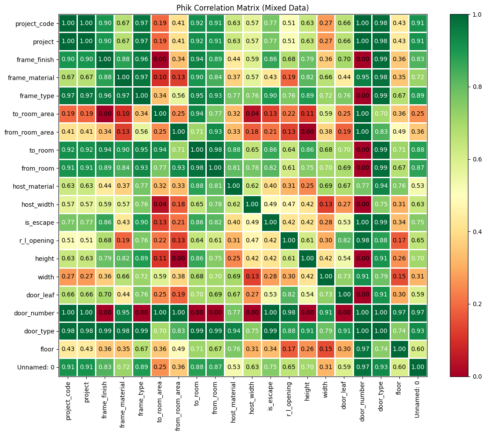
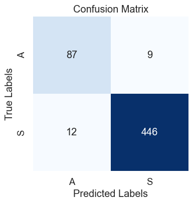
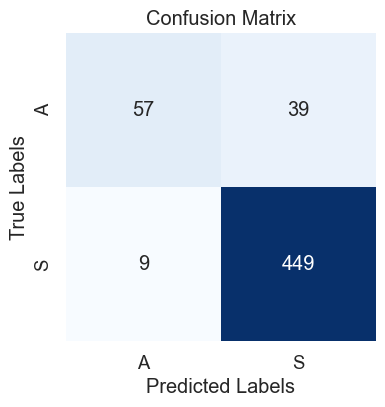
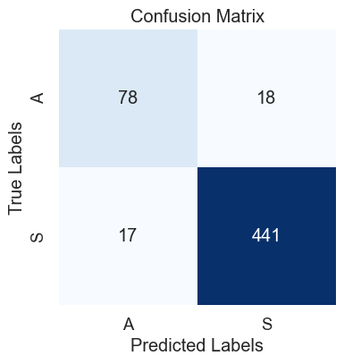

# Door Frame Material Prediction

This project explores classic machine learning for predicting door frame materials in office building projects, using typical tabular BIM data.  
We compare several models (CatBoost, LightGBM, RandomForest), analyze feature importance, and show practical ways to integrate such models into real-world architectural and BIM workflows.

---

## Workflow Overview

- **Train/Test Split:**  
  Models are trained on data from four real office buildings and tested on a fifth (leave-one-building-out cross-validation).

- **Feature Selection:**  
  Features were chosen for their availability across all projects and further filtered using correlation analysis (threshold: 0.6) to avoid data leakage.  
  Feature importance plots (from CatBoost and LightGBM) help interpret which building/door characteristics matter most.

 **Phik Matrix for features**
  

---

## Model Results

### Evaluation
- Models are evaluated using F1-score (macro and micro), class balance, and **confusion matrices**.
- Only high-confidence predictions (mean probability > 85%) are recommended for automation; other predictions can be left empty or reviewed by an expert.

### Feature Importance
- Door geometric features (like width) and contextual features (like host material, from_room, to_room) proved most predictive, as confirmed by both feature importance and correlation checks.

### Confusion Matrices
Below, we compare the classification performance of each model (CatBoost, LightGBM, RandomForest) using confusion matrices. These help identify not just accuracy, but also **where misclassifications occur** (e.g., whether the model is biased toward the majority class).

**Confusion Matrix Catboost**

**Confusion Matrix LightGBM**

**Confusion Matrix Random Forest**

---

## Key Findings

- **CatBoost**: Achieved the best balance between precision and recall, especially on the dominant material class.
- **RandomForest**: Performed well, but required one-hot encoding for categorical features.
- **LightGBM**: Struggled more with minority classes; further tuning or rebalancing may help.
- **Ensemble Voting**: Combined model predictions for greater reliability on confident samples.

---

## Takeaways

- The workflow is easily adaptable for other tabular prediction tasks in architecture or construction (e.g., anomaly detection, missing data imputation).
- **Confusion matrices** provide a clear, actionable way to assess model strengths and weaknesses for each class, informing next steps in feature engineering or model tuning.
- Feature selection based on cross-project availability and correlation control is critical in messy real-world data.

---

> See the notebook for all code, detailed discussion, and further insights into model behavior and feature selection.